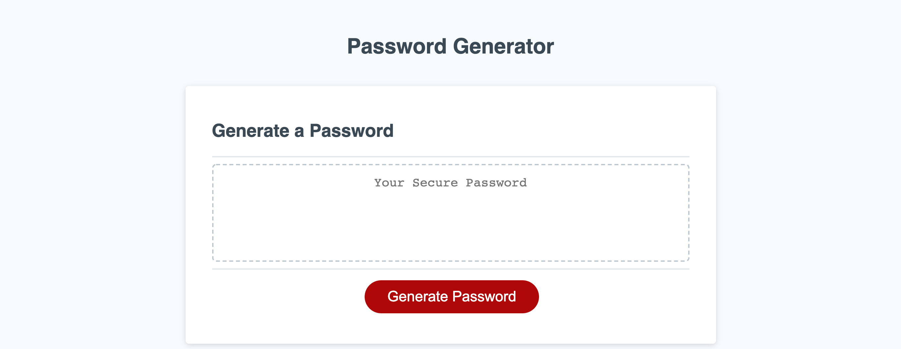

# 03-Javascript-Password-Generator

## Your Task
Modify established starter code by creating javascript code to create random passwords.  Take user input to create a set of requirements including length and possible values for the password.  The Javascript code should dynamically modify the HTML and CSS to create a seamless user experience.

## Criteria
 - Utilize existing CSS and HTML and build a functioning password generator.
 - Prompt user for length and value criteria.
    - Lowercase letters
    - Uppercase letters
    - Special characters
    - Numbers (0-9)
 - Utilize validation to ensure proper user input.
 - Display generated password.

 ## Final Product
 
 https://tallen1985.github.io/03-Javascript-Password-Generator/